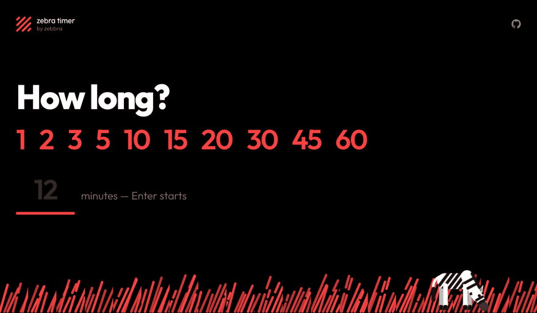
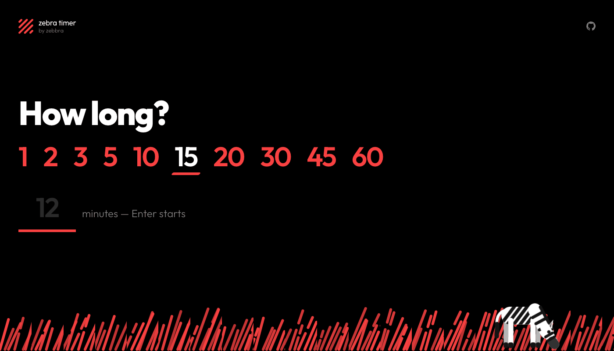
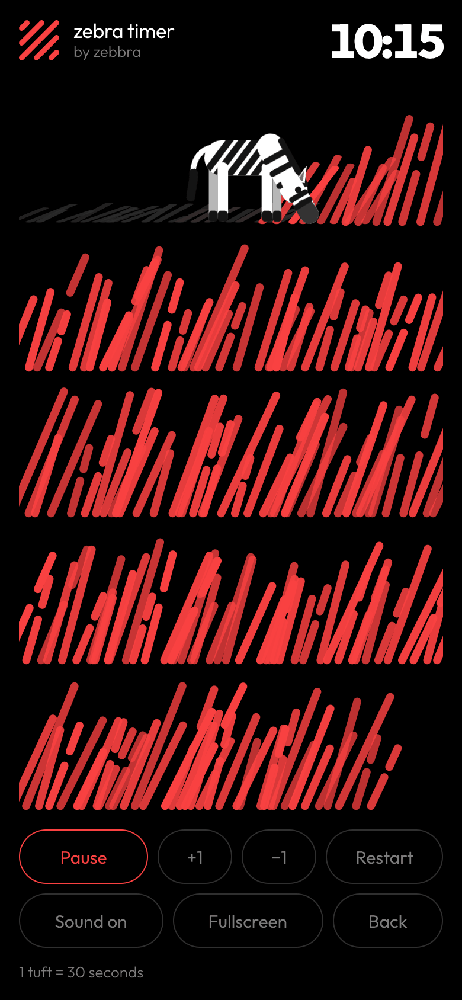

# Zebra Timer

A countdown you can read from the back of the room. The screen fills with red grass, a zebra grazes its way through it, and the red still standing is the time still left.



**→ [zebbra.github.io/zebra-timer](https://zebbra.github.io/zebra-timer/)**  ·  straight into [12 min](https://zebbra.github.io/zebra-timer/?min=12) · [20 min](https://zebbra.github.io/zebra-timer/?min=20) · [45 min](https://zebbra.github.io/zebra-timer/?min=45)

One HTML file. No dependencies, no build step, no accounts, no tracking.

## Why grass

A digit tells you 7:41. It does not tell you that you are two thirds through and should start wrapping up — that takes arithmetic, and mid-discussion nobody does it. A field that is visibly draining says the same thing at a glance, from six metres away, without anyone breaking off. The exact number is still in the corner for when you actually want it.



## Starting straight from a link

`?min=<number>` starts the countdown the moment the page opens. Valid range is 1–240; anything else falls back to the picker.

```
https://zebbra.github.io/zebra-timer/?min=12
```

It works the other way round too: any timer you start by hand writes its duration into the address bar, so copying the URL is enough to share it.

> **Sound:** A timer opened from a link has seen no user interaction yet, so browsers keep the audio context suspended. The end chime only fires once somebody has clicked into the window or pressed a key. The visual end signal — a full-screen flash — is unaffected.

## Controls

| Input               | Effect                         |
| ------------------- | ------------------------------ |
| Click a preset      | start 1–60 minutes             |
| Number + Enter      | any duration (1–240 min)       |
| Tap/click the field | pause / resume                 |
| `Space`             | pause / resume                 |
| `↑` / `↓`           | add or drop a minute, mid-run  |
| `R`                 | restart with the same duration |
| `S`                 | mute or unmute the end chime   |
| `F`                 | fullscreen (for a projector)   |
| `Esc`               | back to the picker             |

"Give us two more minutes" is the most common thing said in any workshop, so `↑` grows the meadow while it runs. Once the timer has run out, `↑` means one more minute from now rather than from a total that is already in the past.



On a touch device the keyboard hints turn into real buttons and the presets get thumb-sized targets. Fullscreen only appears where the browser actually has the API — it shows on Android, and is hidden on iOS Safari, which has none for pages.

## When it runs out

The meadow empties, the zebra looks up, the screen flashes and the chime plays. Then the clock turns red and counts up — `+1:40` tells the room exactly how far over the session is running, which is usually the number somebody wants.

The tab title carries the countdown too (`7:41 · Zebra Timer`), so a timer on a background tab is still readable from the tab strip. While a timer runs the page holds a screen wake lock, so the display does not go to sleep mid-countdown.

## Granularity

One tuft is one minute, as long as that lands between 24 and 60 tufts. Shorter timers step down to 30/15/10/5 seconds, longer ones up to 2/5 minutes. The caption in the bottom left always says what a tuft is currently worth.

<details>
<summary>Why not always one tuft per minute</summary>

Five minutes would be five tufts — the meadow looks empty and the grazing jumps. Three hours would be 180, which nobody can read. Holding the count between 24 and 60 keeps both ends usable without making the unit awkward.
</details>

<br clear="right">

## Slack

A Workflow Builder shortcut that asks for minutes and DMs you the link — no code. See [`SLACK.md`](SLACK.md).

## License

MIT — see [`LICENSE`](LICENSE). Use it, fork it, rebrand it. The stripes are zebbra's, the idea is not.

## Development

`?speed=60` runs the clock 60× faster, so a 12-minute timer is done in 12 seconds. Combine them: `?min=12&speed=60`.

Colours, zebra stripes and grass blades all use the same stroke as the zebbra logomark: 45°, round caps, varying lengths, some broken into segments. Brand red is `#f94141`, and the logomark is zebbra's own.
